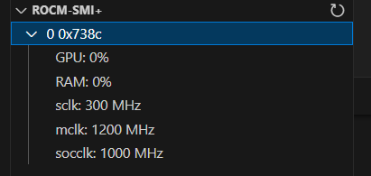

# rocm-smi-plus

This is an extension that display AMD GPU informations on Linux from rocm-smi in VSCode's explorer tab. Currently it shows
 - GPU utilization
 - VRAM utilization
 - sclk in MHz
 - mclk in MHz
 - socclk in MHz(if supported)

Currently the polling interval is fixed to 1 second.

# Todo
 - Adjustable polling duration
 - Adjustable display fields